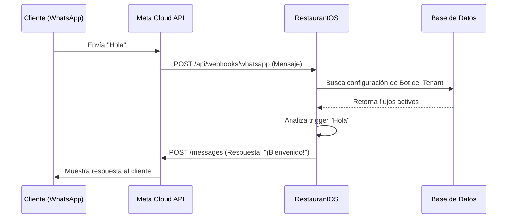

# 🤖 Guía de Integración Técnica: WhatsApp Cloud API

Para que el Bot funcione con un número real (+57...), debes conectar la plataforma a la API oficial de Meta (Facebook).

## Requisitos Previos

1. Una cuenta de Facebook Business Manager.
2. Un número de teléfono que **NO** esté registrado actualmente en WhatsApp (o debes borrar la cuenta de WhatsApp Business App de ese número para liberarlo).

---

## Paso 1: Crear la App en Meta Developers

1. Ve a [developers.facebook.com](https://developers.facebook.com) > **My Apps** > **Create App**.
2. Tipo de App: **Business**.
3. Añade el producto **WhatsApp** a tu app.

## Paso 2: Configurar el Número

1. En el panel de WhatsApp > **API Setup**.
2. Verás un "Test Number". Para producción, ve a **Configuration** e inicia el proceso para agregar tu número real.
3. Verificarás el número vía SMS/Llamada.

## Paso 3: Obtener Credenciales

Necesitas 3 datos clave para ponerlos en las **Variables de Entorno (`.env`)** de tu servidor (Vercel):

### A. WhatsApp Token (`WHATSAPP_API_TOKEN`)

* Para pruebas: Meta te da un token temporal de 24h.
* Para producción: Debes crear un **System User** en el Business Manager con permisos de `whatsapp_business_messaging` y generar un token permanente.

### B. Phone Number ID (`WHATSAPP_PHONE_ID`)

* Se encuentra en la sección **API Setup**. Es un ID largo numérico (ej: `1092837465...`).

### C. Verify Token (`WHATSAPP_VERIFY_TOKEN`)

* Este es un "password" que tú inventas (ej: `restaurantos_secret_123`).
* Debes ponerlo tanto en tu `.env` como en la configuración de **Webhooks** de Meta.

## Paso 4: Configurar el Webhook

Para que el bot "escuche" los mensajes entrantes:

1. En Meta Developers > WhatsApp > **Configuration** > **Webhook**.
2. **Callback URL**: `https://tudominio.com/api/webhooks/whatsapp`
3. **Verify Token**: El que inventaste en el paso 3C.
4. Haz clic en **Verify and Save**.
5. Suscríbete al evento `messages`.

---

## ⚠️ Checklist de Producción

* [ ] El número tiene calidad "Green" en Meta Manager.
* [ ] Has configurado los métodos de pago en Meta si planeas superar las 1000 conversaciones gratuitas al mes.
* [ ] El Webhook responde con status 200 (OK).

---

## Diagrama de Flujo del Bot

